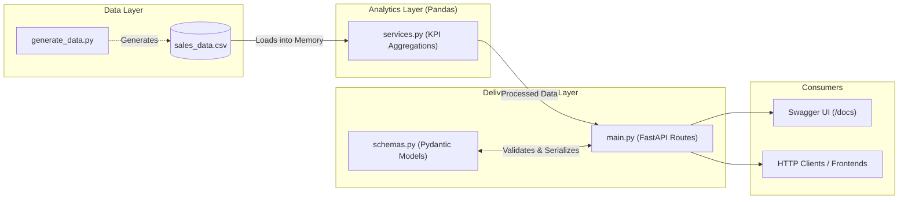

# Real-Time E-Commerce Insights Engine 🚀

[](https://opensource.org/licenses/MIT)
[](https://www.python.org/)
[](https://fastapi.tiangolo.com/)
[](https://pandas.pydata.org/)
[](https://www.docker.com/)

A comprehensive Python educational and demonstration project showcasing the integration of data analysis (**Pandas**) with modern backend web delivery (**FastAPI**), complete with typed **Pydantic** schemas, automated **pytest** testing, and **Docker** containerization.

---

## Features

* **Dynamic Data Ingestion:** Automates the generation and parsing of raw e-commerce transaction data.
* **On-the-fly Analytics:** Calculates key performance indicators (KPIs) including total revenue, average order value, and categorical breakdowns with Pandas.
* **Type-Safe API Contracts:** Validates requests and serializes responses using Pydantic models.
* **Automated Testing Suite:** Fully tested using `pytest` and `httpx.AsyncClient` / `TestClient`.
* **RESTful Delivery & Swagger UI:** Exposes business logic through an interactive OpenAPI interface.
* **Containerized Environment:** Fully supported Docker deployment for seamless execution across all platforms.
* **Hands-on Student Labs:** Includes structured practice labs in [EXERCISES.md](EXERCISES.md).

---

## Quick Start (Local Setup)

### Option A: Using the Makefile (Recommended)

```bash
# 1. Clone repository
git clone https://github.com/AhmadAbukhuit/ecommerce-insights-api.git
cd ecommerce-insights-api

# 2. Setup virtual environment & install dependencies
make venv
make install

# 3. Generate sample data & start the server
make data
make run
```

---

### Option B: Manual Setup

1. **Clone the repository:**

   ```bash
   git clone https://github.com/AhmadAbukhuit/ecommerce-insights-api.git
   cd ecommerce-insights-api
   ```

2. **Create a virtual environment and install dependencies:**

   ```bash
   python -m venv .venv
   source .venv/bin/activate  # On Windows use: .venv\Scripts\activate
   pip install -r requirements.txt
   ```

3. **Generate the sample dataset:**

   ```bash
   python app/generate_data.py
   ```

4. **Run the development server:**

   ```bash
   uvicorn app.main:app --reload --host 0.0.0.0 --port 8000
   ```

5. **Test the API:**
   Open [http://localhost:8000/docs](http://localhost:8000/docs) in your browser.

---

## Running the Automated Tests

Run the test suite with `pytest`:

```bash
make test
# or directly: pytest -v
```

---

## Quick Start (Docker)

If you have Docker installed, launch the entire stack with one command:

```bash
docker compose up --build
```

The API and interactive Swagger UI will be available at [http://localhost:8000/docs](http://localhost:8000/docs).

---

## 🎓 Student Exercises & Labs

Looking for guided practice? Check out [EXERCISES.md](EXERCISES.md) for 5 progressive, hands-on labs covering:

1. Health checks and Pydantic response models.
2. Query parameter date-range filtering with Pandas.
3. Top-performing categories aggregation.
4. Transaction ingestion with HTTP `POST` and input validation.
5. Test-Driven Development (TDD) using `pytest`.

---

## 🏛️ System Architecture


